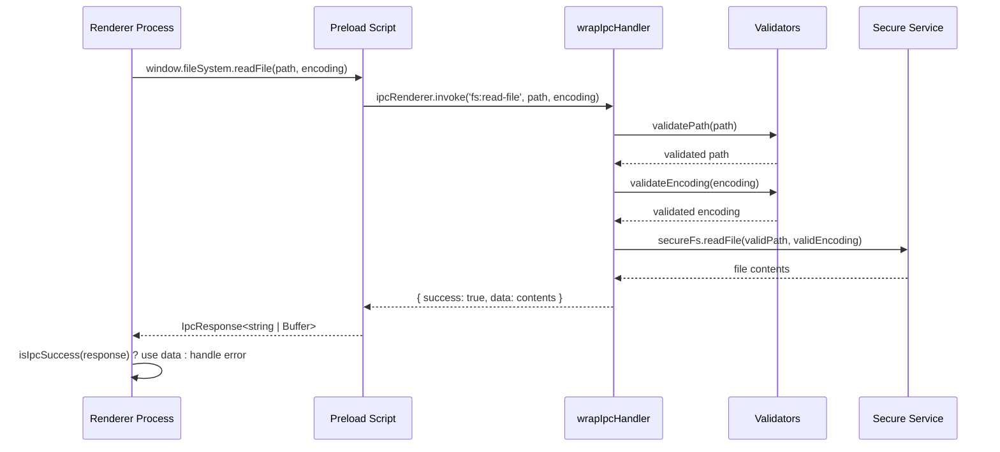
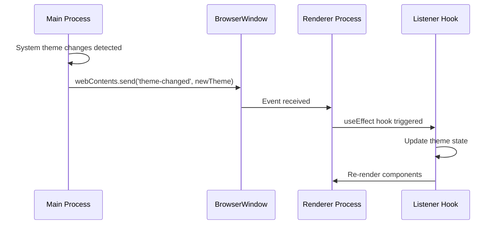
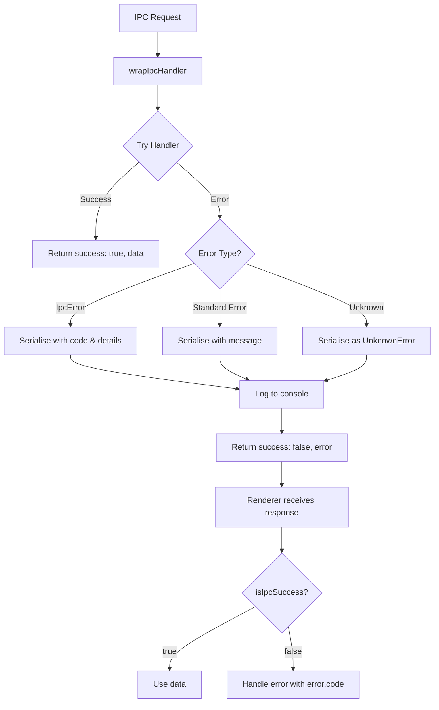

# IPC Messaging Architecture

**Last Updated**: 5 December 2025
**Status**: Complete
**Version**: 1.0.0

---

## Table of Contents

1. [Overview](#overview)
2. [Architecture Principles](#architecture-principles)
3. [Channel Naming Convention](#channel-naming-convention)
4. [Error Handling System](#error-handling-system)
5. [Request Validation](#request-validation)
6. [Type Safety](#type-safety)
7. [IPC Flow Diagrams](#ipc-flow-diagrams)
8. [Channel Registry](#channel-registry)
9. [Adding New IPC Handlers](#adding-new-ipc-handlers)
10. [Security Considerations](#security-considerations)
11. [Performance Guidelines](#performance-guidelines)
12. [Troubleshooting](#troubleshooting)

---

## Overview

DexReader uses Electron's IPC (Inter-Process Communication) system to enable secure communication between the main process (Node.js) and renderer process (web browser). Our architecture emphasises type safety, error handling, validation, and maintainability.

### Why IPC?

Electron applications run in multiple processes for security and stability:

- **Main Process**: Has full access to Node.js APIs and system resources
- **Renderer Process**: Runs web content with restricted access (context isolation enabled)
- **Preload Script**: Bridge between main and renderer with controlled API exposure

IPC enables the renderer to request operations from the main process (like filesystem access) without compromising security.

### Key Features

- ✅ **37 IPC channels** across 6 categories
- ✅ **Automatic error serialisation** with development/production modes
- ✅ **Runtime validation** for critical operations
- ✅ **End-to-end type safety** with TypeScript
- ✅ **Centralised error handling** with custom error classes
- ✅ **Security-first design** with path validation and context isolation

---

## Architecture Principles

### 1. Separation of Concerns

```
Main Process (index.ts)
  ↓ registers handlers
IPC Handlers (filesystemHandlers.ts, etc.)
  ↓ validates & processes
Secure Services (secureFs.ts, theme.ts)
  ↓ exposes via preload
Preload Script (index.ts)
  ↓ type-safe bridge
Renderer Process (React components)
```

### 2. Layered Security

1. **Context Isolation**: Renderer cannot access Node.js directly
2. **Path Validation**: All filesystem paths validated against allowed directories
3. **Input Validation**: Runtime validation of all IPC arguments
4. **Error Sanitisation**: No sensitive info leaked in error messages
5. **Type Safety**: TypeScript prevents type-related vulnerabilities

### 3. Error Handling Philosophy

- **Never throw generic errors** - use custom error classes (`FileSystemError`, `ValidationError`, etc.)
- **Serialise all errors** - convert Error objects to plain objects for IPC transmission
- **Development vs Production** - include stack traces in dev, sanitise in production
- **Wrap all handlers** - use `wrapIpcHandler` for automatic error catching

### 4. Type Safety

- **Shared types** - `src/preload/ipc.types.ts` accessible by all processes
- **Generic responses** - `IpcResponse<T>` wrapper for standardised returns
- **Type guards** - `isIpcSuccess<T>` and `isIpcError<T>` for safe discrimination
- **No `any` types** - strict TypeScript mode enabled

---

## Channel Naming Convention

### Pattern: `<category>:<action>`

```typescript
// Filesystem operations
'fs:read-file'
'fs:write-file'
'fs:mkdir'

// Theme operations
'theme:get-system-accent-color'

// Menu operations
'menu:update-state'
```

### Event Channels (No Prefix)

Event channels that push data from main to renderer use simple names:

```typescript
'navigate' // Navigation event
'theme-changed' // Theme change event
'accent-color-changed'
```

### Category Definitions

| Category   | Prefix      | Description                    | Example                         |
| ---------- | ----------- | ------------------------------ | ------------------------------- |
| Filesystem | `fs:`       | File and directory operations  | `fs:read-file`                  |
| Theme      | `theme:`    | System theme and accent colour | `theme:get-system-accent-color` |
| Menu       | `menu:`     | Application menu actions       | `menu:update-state`             |
| Dialogue   | `dialogue:` | Native dialogues               | `show-confirm-dialog`           |
| Navigation | (none)      | Route navigation events        | `navigate`                      |
| Window     | (none)      | Window management              | (future)                        |

---

## Error Handling System

### Custom Error Classes

All IPC operations use custom error classes for clear error identification:

```typescript
// Base error class
class IpcError extends Error {
  constructor(
    public code: string,
    message: string,
    public details?: unknown
  ) {
    super(message)
    this.name = 'IpcError'
  }
}

// Filesystem errors
class FileSystemError extends IpcError {
  constructor(operation: string, path: string, originalError: unknown) {
    super('FS_ERROR', `Filesystem operation '${operation}' failed for path: ${path}`, {
      operation,
      path,
      originalError
    })
  }
}

// Validation errors
class ValidationError extends IpcError {
  constructor(field: string, reason: string) {
    super('VALIDATION_ERROR', `Validation failed for '${field}': ${reason}`, { field, reason })
  }
}

// Theme errors
class ThemeError extends IpcError {
  constructor(operation: string, originalError: unknown) {
    super('THEME_ERROR', `Theme operation '${operation}' failed`, { operation, originalError })
  }
}
```

### Error Serialisation

Errors cannot be directly transmitted over IPC, so we serialise them:

```typescript
interface ISerialiseError {
  name: string
  message: string
  code?: string
  details?: unknown
  stack?: string // Only in development
}

function serialiseError(error: unknown): ISerialiseError {
  if (error instanceof IpcError) {
    return {
      name: error.name,
      message: error.message,
      code: error.code,
      details: error.details,
      stack: process.env.NODE_ENV === 'development' ? error.stack : undefined
    }
  }

  if (error instanceof Error) {
    return {
      name: error.name,
      message: error.message,
      stack: process.env.NODE_ENV === 'development' ? error.stack : undefined
    }
  }

  return {
    name: 'UnknownError',
    message: String(error)
  }
}
```

### Handler Wrapper

All IPC handlers use `wrapIpcHandler` for automatic error catching:

```typescript
function wrapIpcHandler<T = unknown, R = unknown>(
  channel: string,
  handler: IpcHandler<T, R>
): void {
  ipcMain.handle(channel, async (event, ...args: T[]) => {
    try {
      const result = await handler(event, ...args)
      return { success: true, data: result }
    } catch (error) {
      console.error(`[IPC Error] "${channel}":`, error)
      return { success: false, error: serialiseError(error) }
    }
  })
}
```

### Usage Example

```typescript
// Main process
wrapIpcHandler('fs:read-file', async (_event, filePath: unknown, encoding: unknown) => {
  const validPath = validatePath(filePath, 'filePath')
  const validEncoding = validateEncoding(encoding, 'encoding')
  return await secureFs.readFile(validPath, validEncoding)
})

// Renderer process
const response = await window.fileSystem.readFile('/path/to/file.txt', 'utf-8')
if (isIpcSuccess(response)) {
  console.log('File content:', response.data)
} else {
  console.error('Error:', response.error.message)
  if (response.error.code === 'VALIDATION_ERROR') {
    // Handle validation error
  }
}
```

---

## Request Validation

### Validation Utilities

Three core validators ensure parameter integrity:

```typescript
// String type validation
function validateString(value: unknown, fieldName: string): string {
  if (typeof value !== 'string') {
    throw new ValidationError(
      fieldName,
      `Invalid type for ${fieldName}: expected string, but got ${typeof value}`
    )
  }
  return value
}

// Path validation (non-empty string)
function validatePath(value: unknown, fieldName: string): string {
  const path = validateString(value, fieldName)

  if (path.length === 0) {
    throw new ValidationError(fieldName, `Invalid value for ${fieldName}: path cannot be empty`)
  }

  return path
}

// Encoding validation (BufferEncoding enum)
function validateEncoding(value: unknown, fieldName: string): BufferEncoding | undefined {
  if (value === undefined) return undefined

  const str = validateString(value, fieldName)

  const validEncodings: BufferEncoding[] = [
    'ascii',
    'utf8',
    'utf-8',
    'utf16le',
    'ucs2',
    'base64',
    'latin1',
    'binary',
    'hex'
  ]

  if (!validEncodings.includes(str as BufferEncoding)) {
    throw new ValidationError(
      fieldName,
      `Invalid value for ${fieldName}: unsupported encoding "${str}"`
    )
  }

  return str as BufferEncoding
}
```

### Applying Validation

All filesystem handlers validate parameters before processing:

```typescript
// Example: fs:read-file
wrapIpcHandler('fs:read-file', async (_event, filePath: unknown, encoding: unknown) => {
  const validPath = validatePath(filePath, 'filePath')
  const validEncoding = validateEncoding(encoding, 'encoding')
  return await secureFs.readFile(validPath, validEncoding)
})

// Example: fs:copy-file (multiple paths)
wrapIpcHandler('fs:copy-file', async (_event, srcPath: unknown, destPath: unknown) => {
  const validSrcPath = validatePath(srcPath, 'srcPath')
  const validDestPath = validatePath(destPath, 'destPath')
  await secureFs.copyFile(validSrcPath, validDestPath)
  return true
})
```

### Validation Coverage

| Handler          | Validators Applied             | Coverage |
| ---------------- | ------------------------------ | -------- |
| `fs:read-file`   | validatePath, validateEncoding | ✅ Full  |
| `fs:write-file`  | validatePath                   | ✅ Full  |
| `fs:copy-file`   | validatePath (×2)              | ✅ Full  |
| `fs:append-file` | validatePath                   | ✅ Full  |
| `fs:rename`      | validatePath (×2)              | ✅ Full  |
| `fs:is-exists`   | validatePath                   | ✅ Full  |
| `fs:mkdir`       | validatePath                   | ✅ Full  |
| `fs:unlink`      | validatePath                   | ✅ Full  |
| `fs:rm`          | validatePath                   | ✅ Full  |
| `fs:stat`        | validatePath                   | ✅ Full  |
| `fs:readdir`     | validatePath                   | ✅ Full  |

---

## Type Safety

### Shared Type Definitions

All IPC types live in `src/preload/ipc.types.ts` for cross-process access:

```typescript
// Error type (shared across processes)
export interface ISerialiseError {
  name: string
  message: string
  code?: string
  details?: unknown
  stack?: string
}

// Generic response wrapper
export interface IpcResponse<T = unknown> {
  success: boolean
  data?: T
  error?: ISerialiseError
}

// Filesystem types
export interface FileStats {
  isFile: boolean
  isDirectory: boolean
  size: number
  created: string
  modified: string
}

export interface AllowedPaths {
  appData: string
  downloads: string
}

export interface FolderSelectResult {
  cancelled: boolean
  filePath: string | undefined
}
```

### Preload API Types

```typescript
// src/preload/index.d.ts
interface FileSystem {
  readFile: (filePath: string, encoding?: BufferEncoding) => Promise<IpcResponse<string | Buffer>>
  writeFile: (filePath: string, data: string | Buffer) => Promise<IpcResponse<boolean>>
  copyFile: (srcPath: string, destPath: string) => Promise<IpcResponse<boolean>>
  stat: (path: string) => Promise<IpcResponse<FileStats>>
  getAllowedPaths: () => Promise<IpcResponse<AllowedPaths>>
  selectDownloadsFolder: () => Promise<IpcResponse<FolderSelectResult>>
  // ... more methods
}
```

### Type Guards

Type guards enable safe type discrimination in the renderer:

```typescript
// src/renderer/src/utils/ipcTypeGuards.ts
export function isIpcSuccess<T>(
  response: IpcResponse<T>
): response is IpcResponse<T> & { success: true; data: T } {
  return response.success === true && response.data !== undefined
}

export function isIpcError<T>(
  response: IpcResponse<T>
): response is IpcResponse<T> & { success: false; error: ISerialiseError } {
  return response.success === false && response.error !== undefined
}
```

### Usage in Renderer

```typescript
const response = await window.fileSystem.readFile(path, 'utf-8')

if (isIpcSuccess(response)) {
  // TypeScript knows response.data is string | Buffer
  const content = response.data
  setFileContent(content)
} else {
  // TypeScript knows response.error is ISerialiseError
  console.error(`Failed to read file: ${response.error.message}`)

  // Handle specific error codes
  if (response.error.code === 'FS_ERROR') {
    toast.error("Couldn't read the file. It might have been moved or deleted.")
  } else if (response.error.code === 'VALIDATION_ERROR') {
    toast.error('Invalid file path provided.')
  }
}
```

---

## IPC Flow Diagrams

### Invoke Flow (Request-Response)



### Event Flow (Push Updates)



### Error Propagation Flow



---

## Channel Registry

### Complete Channel List (37 Channels)

#### Filesystem (16 channels)

| Channel                      | Type   | Description                     | Request                                              | Response             |
| ---------------------------- | ------ | ------------------------------- | ---------------------------------------------------- | -------------------- |
| `fs:read-file`               | invoke | Read file contents              | `filePath: string, encoding?: BufferEncoding`        | `string \| Buffer`   |
| `fs:write-file`              | invoke | Write file contents             | `filePath: string, data: string \| Buffer`           | `boolean`            |
| `fs:append-file`             | invoke | Append to file                  | `filePath: string, data: string \| Buffer`           | `boolean`            |
| `fs:copy-file`               | invoke | Copy file                       | `srcPath: string, destPath: string`                  | `boolean`            |
| `fs:rename`                  | invoke | Rename file/directory           | `oldPath: string, newPath: string`                   | `boolean`            |
| `fs:is-exists`               | invoke | Check path existence            | `path: string`                                       | `boolean`            |
| `fs:mkdir`                   | invoke | Create directory                | `dirPath: string`                                    | `boolean`            |
| `fs:unlink`                  | invoke | Delete file                     | `filePath: string`                                   | `boolean`            |
| `fs:rm`                      | invoke | Delete directory                | `dirPath: string, options?: { recursive?: boolean }` | `boolean`            |
| `fs:stat`                    | invoke | Get file/directory stats        | `path: string`                                       | `FileStats`          |
| `fs:readdir`                 | invoke | List directory contents         | `dirPath: string`                                    | `string[]`           |
| `fs:get-allowed-paths`       | invoke | Get AppData and downloads paths | (none)                                               | `AllowedPaths`       |
| `fs:select-downloads-folder` | invoke | Open folder picker dialogue     | (none)                                               | `FolderSelectResult` |

#### Theme (4 channels)

| Channel                         | Type   | Description                  | Request | Response              |
| ------------------------------- | ------ | ---------------------------- | ------- | --------------------- |
| `get-theme`                     | invoke | Get current system theme     | (none)  | `'light' \| 'dark'`   |
| `theme:get-system-accent-color` | invoke | Get OS accent colour         | (none)  | `string` (hex colour) |
| `theme-changed`                 | on     | System theme changed event   | (none)  | `'light' \| 'dark'`   |
| `accent-color-changed`          | on     | System accent colour changed | (none)  | `string` (hex colour) |

#### Menu (14 channels)

| Channel              | Type | Description                          | Request            | Response |
| -------------------- | ---- | ------------------------------------ | ------------------ | -------- |
| `update-menu-state`  | send | Update dynamic menu item states      | `MenuState` object | (none)   |
| `check-for-updates`  | on   | Check for updates menu item clicked  | (none)             | (none)   |
| `add-to-favorites`   | on   | Add to favourites menu item clicked  | (none)             | (none)   |
| `create-collection`  | on   | Create collection menu item clicked  | (none)             | (none)   |
| `manage-collections` | on   | Manage collections menu item clicked | (none)             | (none)   |
| `import-library`     | on   | Import library menu item clicked     | (none)             | (none)   |
| `import-tachiyomi`   | on   | Import Tachiyomi menu item clicked   | (none)             | (none)   |
| `export-library`     | on   | Export library menu item clicked     | (none)             | (none)   |
| `export-tachiyomi`   | on   | Export Tachiyomi menu item clicked   | (none)             | (none)   |
| `download-chapter`   | on   | Download chapter menu item clicked   | (none)             | (none)   |
| `download-manga`     | on   | Download manga menu item clicked     | (none)             | (none)   |
| `clear-cache`        | on   | Clear cache menu item clicked        | (none)             | (none)   |
| `clear-history`      | on   | Clear history menu item clicked      | (none)             | (none)   |
| `show-shortcuts`     | on   | Show shortcuts menu item clicked     | (none)             | (none)   |

#### Dialogue (2 channels)

| Channel               | Type   | Description                     | Request                            | Response                                         |
| --------------------- | ------ | ------------------------------- | ---------------------------------- | ------------------------------------------------ |
| `show-confirm-dialog` | invoke | Show simple yes/no confirmation | `message: string, detail?: string` | `boolean`                                        |
| `show-dialog`         | invoke | Show multi-choice dialogue      | `DialogOptions`                    | `{ response: number, checkboxChecked: boolean }` |

#### Navigation (1 channel)

| Channel    | Type | Description                     | Request         | Response |
| ---------- | ---- | ------------------------------- | --------------- | -------- |
| `navigate` | on   | Menu-triggered navigation event | `route: string` | (none)   |

### Querying the Registry

Use helper functions to query channel information:

```typescript
import { IPC_REGISTRY, getChannelsByCategory, getChannelDefinition } from '@/main/ipc/registry'

// Get all filesystem channels
const fsChannels = getChannelsByCategory('filesystem')
console.log(`Found ${fsChannels.length} filesystem channels`)

// Get specific channel definition
const readFileChannel = getChannelDefinition('fs:read-file')
console.log(readFileChannel?.description)
console.log(readFileChannel?.errorTypes)
```

---

## Adding New IPC Handlers

Follow these steps to add a new IPC handler safely:

### Step 1: Define Types

Add shared types to `src/preload/ipc.types.ts`:

```typescript
// Request/response types
export interface MyOperationRequest {
  param1: string
  param2: number
}

export interface MyOperationResponse {
  result: string
  metadata: Record<string, unknown>
}
```

### Step 2: Create Validators (if needed)

Add custom validators to `src/main/ipc/validators.ts`:

```typescript
export function validateMyParam(value: unknown, fieldName: string): string {
  const str = validateString(value, fieldName)

  if (!str.match(/^[a-zA-Z0-9]+$/)) {
    throw new ValidationError(fieldName, `Invalid value for ${fieldName}: must be alphanumeric`)
  }

  return str
}
```

### Step 3: Implement Handler

Add handler to appropriate file (e.g., `src/main/index.ts` or handler module):

```typescript
import { wrapIpcHandler } from './ipc/wrapHandler'
import { validateMyParam } from './ipc/validators'

wrapIpcHandler('my:operation', async (_event, param1: unknown, param2: unknown) => {
  // Validate inputs
  const validParam1 = validateMyParam(param1, 'param1')
  const validParam2 = validateNumber(param2, 'param2')

  // Process operation
  const result = await myService.doOperation(validParam1, validParam2)

  // Return typed response
  return {
    result: result.value,
    metadata: result.meta
  }
})
```

### Step 4: Expose in Preload

Add method to preload script (`src/preload/index.ts`):

```typescript
const api = {
  // ... existing methods
  myOperation: (param1: string, param2: number): Promise<IpcResponse<MyOperationResponse>> =>
    ipcRenderer.invoke('my:operation', param1, param2)
}

contextBridge.exposeInMainWorld('myApi', api)
```

### Step 5: Update Type Definitions

Add types to `src/preload/index.d.ts`:

```typescript
interface MyApi {
  myOperation: (param1: string, param2: number) => Promise<IpcResponse<MyOperationResponse>>
}

interface Window {
  myApi: MyApi
}
```

### Step 6: Register in IPC Registry

Add channel definition to `src/main/ipc/registry.ts`:

```typescript
{
  channel: 'my:operation',
  category: 'custom',
  type: 'invoke',
  description: 'Performs custom operation with validation',
  requestType: 'string, number',
  responseType: 'MyOperationResponse',
  errorTypes: ['ValidationError', 'IpcError'],
  example: 'await window.myApi.myOperation("test", 42)'
}
```

### Step 7: Use in Renderer

Use type guards in React components:

```typescript
const handleOperation = async () => {
  const response = await window.myApi.myOperation('test', 42)

  if (isIpcSuccess(response)) {
    console.log('Result:', response.data.result)
    toast.success('Operation completed successfully!')
  } else {
    console.error('Error:', response.error.message)
    toast.error(`Operation failed: ${response.error.message}`)
  }
}
```

### Checklist

- [ ] Types defined in `ipc.types.ts`
- [ ] Validators created (if needed)
- [ ] Handler implemented with `wrapIpcHandler`
- [ ] Validation applied to all parameters
- [ ] Preload method added
- [ ] Type definitions updated
- [ ] Registry entry created
- [ ] Renderer usage documented
- [ ] Error handling tested
- [ ] TypeScript compilation passing

---

## Security Considerations

### Context Isolation

Context isolation is **enabled** in DexReader, which means:

- ✅ Renderer cannot access Node.js APIs directly
- ✅ Renderer cannot access main process objects
- ✅ All communication goes through controlled IPC channels
- ✅ Only explicitly exposed APIs are available via `contextBridge`

### Path Validation

All filesystem operations validate paths against allowed directories:

```typescript
// Allowed directories (configured at runtime)
const allowedPaths = [
  getAppDataPath(), // C:\Users\<user>\AppData\Roaming\DexReader
  getDownloadsPath() // User-configured downloads folder
]

// Path validation (in secureFs.ts)
function isPathAllowed(targetPath: string): boolean {
  const normalized = normalizePath(targetPath)
  return allowedPaths.some((allowed) => normalized.startsWith(allowed))
}
```

Security measures:

- ✅ Path traversal attacks blocked (`../../../etc/passwd` rejected)
- ✅ Symlink resolution before validation
- ✅ Absolute path requirement (relative paths rejected)
- ✅ User cannot access system files
- ✅ User cannot access other user's data

### Input Validation

All IPC handlers validate inputs before processing:

```typescript
// Example: Prevents injection attacks
wrapIpcHandler('fs:read-file', async (_event, filePath: unknown) => {
  // Type validation
  const validPath = validatePath(filePath, 'filePath')

  // Path security check (in secureFs)
  if (!isPathAllowed(validPath)) {
    throw new FileSystemError('read', validPath, 'Path not allowed')
  }

  return await fs.readFile(validPath)
})
```

### Error Sanitisation

Production builds sanitise error messages:

```typescript
// Development: Full stack traces
{
  name: 'FileSystemError',
  message: 'Failed to read file: /path/to/settings.json',
  code: 'FS_ERROR',
  details: { operation: 'read', path: '/path/to/settings.json' },
  stack: 'FileSystemError: ...\n    at readFile (/app/main.js:123:45)...'
}

// Production: Sanitised
{
  name: 'FileSystemError',
  message: 'Failed to read file',
  code: 'FS_ERROR',
  details: { operation: 'read' }  // Path removed
  // No stack trace
}
```

### Rate Limiting (Future Enhancement)

Consider adding rate limiting for IPC calls:

```typescript
// Pseudocode for future implementation
const rateLimiter = new Map<string, { count: number; resetTime: number }>()

function checkRateLimit(channel: string, limit: number, windowMs: number): void {
  // Track calls per channel
  // Throw error if limit exceeded
}
```

---

## Performance Guidelines

### Optimisation Principles

1. **Minimise IPC Calls**: Batch operations when possible
2. **Cache Data**: Store frequently accessed data in renderer
3. **Use Events for Updates**: Push changes instead of polling
4. **Stream Large Files**: Don't load entire files into memory
5. **Lazy Load**: Only load data when needed

### Performance Benchmarks

Target performance metrics for IPC operations:

| Operation Type                | Target Latency | Acceptable Range |
| ----------------------------- | -------------- | ---------------- |
| Simple queries (exists, stat) | <5ms           | 0-10ms           |
| Small file reads (<1KB)       | <10ms          | 5-20ms           |
| Medium file reads (1-10KB)    | <50ms          | 20-100ms         |
| Large file operations (>10KB) | <200ms         | 100-500ms        |
| Dialogue operations           | <100ms         | 50-200ms         |
| Theme operations              | <10ms          | 5-20ms           |

### Performance Monitoring

Add performance logging in development:

```typescript
wrapIpcHandler('fs:read-file', async (_event, filePath: unknown) => {
  const start = performance.now()

  const validPath = validatePath(filePath, 'filePath')
  const result = await secureFs.readFile(validPath)

  const duration = performance.now() - start
  if (duration > 100 && process.env.NODE_ENV === 'development') {
    console.warn(`[IPC Performance] fs:read-file took ${duration.toFixed(2)}ms for ${validPath}`)
  }

  return result
})
```

### Best Practices

#### ✅ Do

```typescript
// Batch multiple reads
const files = await Promise.all([
  window.fileSystem.readFile('/path/1.txt', 'utf-8'),
  window.fileSystem.readFile('/path/2.txt', 'utf-8'),
  window.fileSystem.readFile('/path/3.txt', 'utf-8')
])

// Cache allowed paths
const paths = await window.fileSystem.getAllowedPaths()
store.setAllowedPaths(paths.data) // Store in Zustand

// Use events for real-time updates
ipcRenderer.on('theme-changed', (_, theme) => {
  store.setTheme(theme)
})
```

#### ❌ Don't

```typescript
// Don't poll for changes
setInterval(async () => {
  const theme = await window.api.getTheme() // ❌ Wasteful
}, 1000)

// Don't make sequential calls when parallel is possible
const file1 = await window.fileSystem.readFile('/path/1.txt', 'utf-8') // ❌ Slow
const file2 = await window.fileSystem.readFile('/path/2.txt', 'utf-8')
const file3 = await window.fileSystem.readFile('/path/3.txt', 'utf-8')

// Don't load large files into memory
const hugeFile = await window.fileSystem.readFile('/huge-file.txt') // ❌ Memory issue
```

---

## Troubleshooting

### Common Issues

#### Issue: "Module not found" in renderer

**Symptom**: `Cannot find module 'electron'` in renderer code

**Cause**: Trying to import Electron modules directly in renderer

**Solution**: Use preload API instead

```typescript
// ❌ Don't do this in renderer
import { ipcRenderer } from 'electron'

// ✅ Do this instead
const response = await window.fileSystem.readFile(path)
```

#### Issue: "TypeError: Cannot read property 'invoke' of undefined"

**Symptom**: `window.fileSystem` is `undefined`

**Cause**: Preload script not loaded or contextBridge not exposing API

**Solution**: Check preload script path in `BrowserWindow` options

```typescript
new BrowserWindow({
  webPreferences: {
    preload: join(__dirname, '../preload/index.js'), // Correct path
    contextIsolation: true // Must be enabled
  }
})
```

#### Issue: "Validation failed" errors

**Symptom**: `ValidationError: path cannot be empty`

**Cause**: Invalid or missing parameters

**Solution**: Ensure all required parameters are provided

```typescript
// ❌ Wrong
await window.fileSystem.readFile() // Missing path

// ✅ Correct
await window.fileSystem.readFile('/path/to/file.txt', 'utf-8')
```

#### Issue: Type errors in renderer

**Symptom**: TypeScript errors like "Property 'data' does not exist on type 'IpcResponse<T>'"

**Cause**: Not using type guards

**Solution**: Always use `isIpcSuccess` / `isIpcError` guards

```typescript
// ❌ Wrong
const response = await window.fileSystem.readFile(path)
console.log(response.data) // Type error

// ✅ Correct
const response = await window.fileSystem.readFile(path)
if (isIpcSuccess(response)) {
  console.log(response.data) // Type safe
}
```

#### Issue: Errors not being caught

**Symptom**: Uncaught promise rejections or app crashes

**Cause**: Not using `wrapIpcHandler`

**Solution**: Always wrap handlers

```typescript
// ❌ Wrong
ipcMain.handle('my:operation', async (_event, param) => {
  return await myService.doOperation(param) // Errors not caught
})

// ✅ Correct
wrapIpcHandler('my:operation', async (_event, param: unknown) => {
  const validParam = validateParam(param, 'param')
  return await myService.doOperation(validParam) // Errors automatically caught
})
```

### Debugging Tips

#### Enable IPC Logging

```typescript
// In main process
ipcMain.on('*', (event, ...args) => {
  console.log('[IPC]', event.sender, args)
})
```

#### Check Preload Loading

```typescript
// In preload script
console.log('[Preload] Script loaded successfully')
console.log('[Preload] APIs exposed:', Object.keys(window))
```

#### Verify Channel Registration

```typescript
// In main process
import { IPC_REGISTRY } from './ipc/registry'
console.log('Registered channels:', IPC_REGISTRY.length)
```

#### Test with DevTools

Open DevTools console in renderer and test APIs:

```javascript
// Test filesystem API
const response = await window.fileSystem.getAllowedPaths()
console.log(response)

// Test type guards
console.log('isIpcSuccess:', window.isIpcSuccess)
```

---

## Summary

DexReader's IPC architecture provides:

- ✅ **37 IPC channels** for comprehensive app functionality
- ✅ **Type-safe communication** with TypeScript and type guards
- ✅ **Automatic error handling** with serialisation and logging
- ✅ **Runtime validation** for security and reliability
- ✅ **Security-first design** with path validation and context isolation
- ✅ **Developer-friendly patterns** for adding new handlers
- ✅ **Performance-conscious** with monitoring and best practices

All IPC operations follow consistent patterns, making the codebase maintainable and extensible as the application grows.

For implementation details, refer to:

- `src/main/ipc/` - Error classes, validators, wrapper, registry
- `src/preload/` - Type definitions and API exposure
- `src/renderer/src/utils/ipcTypeGuards.ts` - Type guards
- `docs/components/useFileSystem-examples.md` - Usage patterns

---

**Document Version**: 1.0.0
**Last Updated**: 5 December 2025
**Maintained By**: DexReader Core Team
